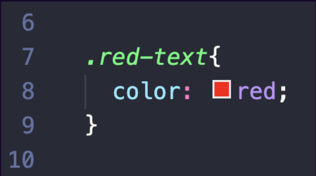

# CSS In-Class Assignment Instructions

### Class Vs. Tag Specificity Rule

1. Open your HTML-in-class-project
2. Open the styles.css file
3. At the top of the file, write a style rule to turn all h1's blue 
4. Look at your website in the browser
5. In your HTML, find an h1 and add a class attribute with a value of "red-text"
6. Write a style rule in your CSS to turn that element red 
7. Which style rule 'won'?

### Inline/Internal/External

1. Using the code examples on the slides, add three different style rules, three different ways (inline, internal, & external)!
   
### As A Group: Dev Tools

### Border Bonanza - Lab Time

1. Open your in-class HTML project
2. Navigate to styles.css 
3. Add a border to each rule in the CSS file (see below for an example)
4. Add borders to at least 20 style rules.
5. You can choose different styles and have fun with it!
6. Check out your work in the browser

